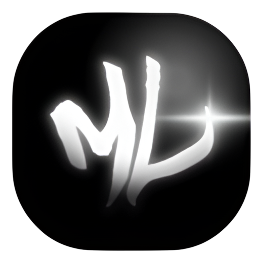
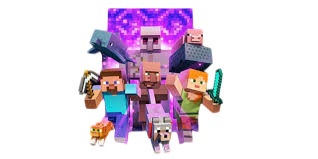

# ModerLauncher 🚀

  

  <a href="#características">Características</a> •
  <a href="#instalación">Instalación</a> •
  <a href="#uso">Uso</a> •
  <a href="#requisitos">Requisitos</a> •
  <a href="#contribuir">Contribuir</a>

Un moderno launcher de Minecraft con interfaz elegante y funciones optimizadas. Diseñado para proporcionar una experiencia fluida y eficiente al jugar Minecraft.

## ✨ Características

- 🎮 **Gestión de Versiones**
  - Soporte para todas las versiones de Minecraft desde 1.0 hasta 1.20.4
  - Instalación y eliminación de versiones con un clic
  - Sistema de detección automática de Java requerido

- 🚀 **Optimización Automática**
  - Gestión inteligente de memoria RAM
  - Argumentos JVM optimizados por defecto
  - Selección automática de Java según la versión

- 👤 **Sistema de Cuentas**
  - Soporte para cuentas Premium (Microsoft/Mojang)
  - Modo offline con UUID persistente
  - Gestión de perfiles de usuario

- ⚙️ **Personalización**
  - Interfaz moderna y personalizable
  - Temas oscuros por defecto
  - Ajustes de rendimiento configurables

- 🛠️ **Características Técnicas**
  - Auto-actualización de Java
  - Sistema de caché inteligente
  - Soporte para múltiples instancias

## 🔧 Requisitos

- Windows 10/11 (64 bits)
- 4GB RAM mínimo (8GB recomendado)
- Conexión a Internet para la primera descarga
- 500MB espacio libre mínimo

## 📥 Instalación

1. Descarga la última versión desde la sección [Releases](https://github.com/tuusuario/ModerLauncher/releases)
2. Ejecuta el instalador `ModerLauncher-Setup.exe`
3. Sigue las instrucciones del asistente
4. ¡Listo para jugar!

## 🎮 Uso

1. Inicia ModerLauncher
2. Selecciona la versión de Minecraft que deseas jugar
3. Ajusta la memoria RAM si lo deseas
4. Haz clic en PLAY

## 🌟 Próximas Características

- [ ] Soporte para modpacks
- [ ] Gestor de mods integrado
- [ ] Sistema de respaldo automático
- [ ] Más temas visuales
- [ ] Optimizaciones adicionales

## 🤝 Contribuir

Las contribuciones son bienvenidas. Por favor, lee [CONTRIBUTING.md](CONTRIBUTING.md) para más detalles.

## 📜 Licencia

Este proyecto está licenciado bajo [MIT License](LICENSE).

## 👥 Equipo

- **JephersonRD** - *Desarrollador Principal* - [GitHub](https://github.com/jephersonRD)

## 🌐 Enlaces

- [YouTube](https://www.youtube.com/@jepherson_rd/videos)
- [TikTok](https://www.tiktok.com/@jepherson_rd)
- [GitHub](https://github.com/jephersonRD)

---

  Hecho con ❤️ por JephersonRD

