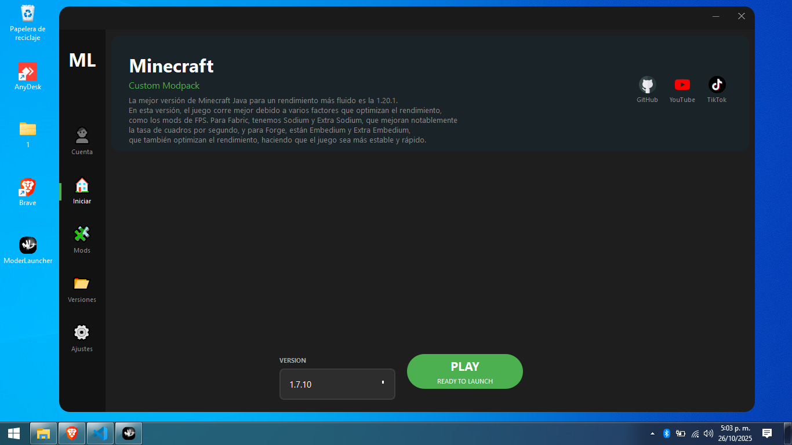

# ModerLauncher GitHub

<p align="center">
  
</p>

<p align="center">
  <a href="#características">Características</a> •
  <a href="#instalación">Instalación</a> •
  <a href="#uso">Uso</a> •
  <a href="#contribuir">Contribuir</a>
</p>

Un moderno launcher de Minecraft con interfaz elegante y funciones optimizadas.



## ✨ Características

### 🎮 Gestión de Versiones
- Soporte para Release, Snapshot, Beta y Alpha
- Integración con **Forge y Fabric**
- Sistema de filtros y búsqueda
- Instalación con un clic

### 🚀 Optimización
- Gestión visual de RAM y núcleos de CPU
- Configuración de prioridad del proceso
- Argumentos JVM optimizados
- Modos de pantalla configurables
- Compatibilidad Java 8 y Java 17

### 👤 Sistema de Cuentas
- Cuentas Premium (Microsoft/Mojang)
- Integración con Ely.by
- Modo offline con UUID persistente
- Gestión de múltiples cuentas

### 🎨 Interfaz Moderna
- Diseño Material Design
- Animaciones fluidas
- Efectos de sonido
- Temas oscuros optimizados

## 🔧 Requisitos

- Windows 10/11 (64 bits)
- Linux Debian/Ubuntu/AntiX (64 bits)
- 2GB RAM mínimo (4GB recomendado)
- Conexión a Internet
- 500MB espacio libre

## 📥 Instalación

1. Descarga desde [Releases](https://github.com/tuusuario/ModerLauncher/releases)
2. Ejecuta `ModerLauncher-Setup.exe`
3. Sigue el asistente de instalación

## 🎮 Uso

1. Inicia ModerLauncher
2. Inicia sesión con tu cuenta
3. Instala tu versión favorita en **Versiones**
4. Ajusta RAM y CPU en **Configuración**
5. Haz clic en **PLAY**

## 🔨 Construcción

### Linux (AppImage)

Para construir el AppImage en sistemas Linux:

1. **Instala dependencias del sistema:**
   ```bash
   sudo apt update
   sudo apt install python3 python3-pip python3-venv fuse libfuse2 appimagetool
   ```

2. **Clona el repositorio:**
   ```bash
   git clone https://github.com/tuusuario/ModerLauncher.git
   cd ModerLauncher
   ```

3. **Instala dependencias de Python:**
   ```bash
   pip3 install --break-system-packages -r requirements.txt
   ```

4. **Ejecuta el script de construcción:**
   ```bash
   chmod +x build_appimage.sh
   ./build_appimage.sh
   ```

5. **Resultado:**
   - El AppImage se creará en la carpeta raíz: `ModerLauncher.AppImage` (~67MB)
   - Archivo ejecutable portable que funciona en sistemas Linux con Python 3.11+

### Windows (EXE)

Para construir el instalador EXE en Windows:

1. Instala Python 3.11+
2. Instala dependencias: `pip install -r requirements.txt`
3. Ejecuta: `python build_windows.py`

## 🌟 Próximas Características

- [ ] Gestor de modpacks
- [ ] Administrador de mods
- [ ] Respaldo automático
- [ ] Más temas visuales

## 🤝 Contribuir

Las contribuciones son bienvenidas. Lee [CONTRIBUTING.md](CONTRIBUTING.md) para más detalles.

## 📜 Licencia

[MIT License](LICENSE)

## 👥 Creador

**JephersonRD** - [GitHub](https://github.com/jephersonRD)

## 🌐 Enlaces

[YouTube](https://www.youtube.com/@jepherson_rd/videos) • [TikTok](https://www.tiktok.com/@jepherson_rd) • [GitHub](https://github.com/jephersonRD)

---

<p align="center">
  Hecho con ❤️ por JephersonRD
</p>


